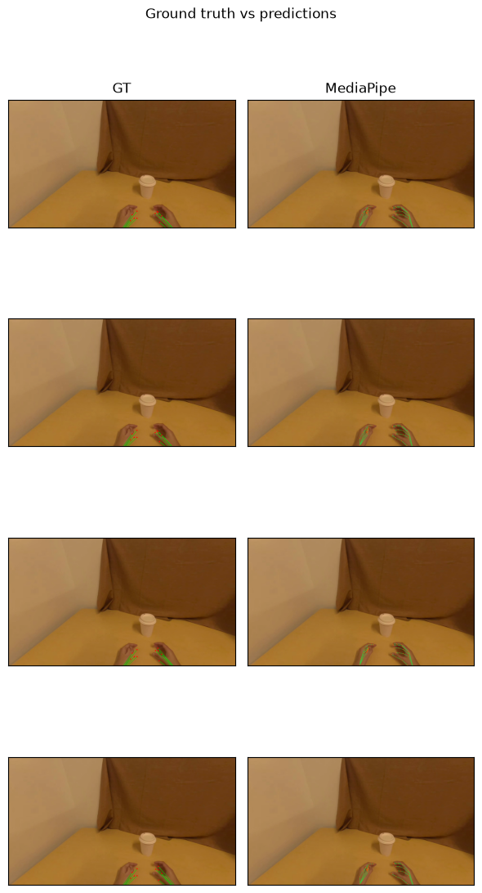

# daft-physical-ai

Physical-AI data processing on [Daft](https://github.com/Eventual-Inc/Daft):
hand tracking, reward scoring, and motion trimming. The methods run as Daft
UDFs and expressions, so they slot into any Daft pipeline and execute lazily,
batched, and distributed.

Available on [PyPI](https://pypi.org/project/daft-physical-ai/):

```bash
pip install daft-physical-ai
```

## Hand tracking

`track_hands` takes a Daft image column and returns a hand-pose column. A
LeRobot dataset is a natural source: Daft's native reader
`daft.datasets.lerobot` (added in [Daft #7090](https://github.com/Eventual-Inc/Daft/pull/7090))
decodes each camera into an image column with `load_video_frames`.

```python
import daft
from daft.datasets import lerobot
from daft_physical_ai.hands import track_hands

# one row per frame; the camera key is decoded into an image column.
# egodex-test is a tiny EgoDex sample (3 episodes / 632 frames) in LeRobot v3 format.
df = lerobot.read("pepijn223/egodex-test", load_video_frames="observation.image")

# pick a method (each returns the same schema):
# mediapipe -> CPU, 2D only, permissive license, no weights to supply
# wilor     -> GPU, 3D MANO keypoints (MANO weights user-supplied)
df = df.with_column("hands", track_hands(df["observation.image"], method="mediapipe"))

df.write_parquet("annotated/")
```

Install the method you need as an extra: `pip install "daft-physical-ai[mediapipe]"`
(CPU, 2D), `pip install "daft-physical-ai[wilor]"` (GPU, 3D), or
`pip install "daft-physical-ai[all]"` for both. WiLoR additionally needs a CUDA
`torch` build and `chumpy` from git
(`pip install 'chumpy @ git+https://github.com/mattloper/chumpy'`, omitted from the
extra because PyPI metadata can't carry direct references), plus a user-supplied
`MANO_RIGHT.pkl` ([research-gated](docs/mano.md)).

### Output schema

One unified output schema regardless of method: each frame yields a list of
0-2 detected hands. A single hand value (MediaPipe):

```python
{
    "handedness": "right",        # "left", "right", or "unknown"
    "confidence": 0.979,
    "kp2d": [[1412.1, 1111.1],    # 21 image-space [x, y] keypoints
             [1357.9, 1075.9],
             ...],
    "kp3d": None,                 # 21 [x, y, z] keypoints, or null for 2D-only methods
}
```

The Daft type is `list[struct{ handedness: string, confidence: float32, kp2d:
list[list[float32]], kp3d: list[list[float32]] }]`, defined as `HANDS_DTYPE` in
`daft_physical_ai/hands/schema.py`.

### Raw EgoDex releases

For Apple's original EgoDex HDF5+MP4 release, use the extension's lazy reader:

```python
from daft_physical_ai.datasets import egodex

episodes = egodex.raw("/data/egodex", tasks="fold_towel").limit(2)
poses = egodex.trajectory(episodes, fields=["transforms/leftHand", "transforms/rightHand"])
frames = egodex.camera_frames(poses, width=224, height=224, sample_interval_seconds=1.0)
```

EgoDex is CC-BY-NC-ND, so the package does not download, extract, or redistribute it. Download and extract the archives from the [official EgoDex repository](https://github.com/apple/ml-egodex), then point `raw()` at your copy. See [the runnable example](examples/egodex_raw_hdf5_video.py).

### Example

A complete walkthrough - read a dataset, run `track_hands` (MediaPipe), draw the
keypoints, and score against EgoDex ground truth:



Available in three equivalent forms:

- **[examples/hands/demo.md](examples/hands/demo.md)** - read it start to finish; code and outputs inline.
- **[examples/hands/demo.ipynb](examples/hands/demo.ipynb)** - runnable notebook (outputs included).
- **[examples/hands/demo.py](examples/hands/demo.py)** - plain script.

Generate your own (other methods, a Modal GPU runtime, with/without eval) with the
`daft-physical-ai hands` command - run it with no flags for an interactive
walkthrough, or pass flags:

```bash
# No flags - interactive walkthrough that asks a few questions
uvx daft-physical-ai hands

# --no-input skips all prompts; flags supply the answers, the rest use defaults
uvx daft-physical-ai hands --method mediapipe --output-dir my-demo --no-input
uvx daft-physical-ai hands --method wilor --runtime modal --mano-path ./MANO_RIGHT.pkl --no-input
```

## Reward scoring

Score episodes with a reward model
([Robometer-4B](https://huggingface.co/robometer/Robometer-4B)) - per-frame
task progress (0-1) plus success probability, written back as a dataset column.
Use it to filter failed or stalled episodes before BC training, as dense reward
for RL post-training, or to catch mislabeled tasks.

```python
from daft_physical_ai.rewards import score_rewards

# one row per episode: task text, length, and where its frames live in the video
# (e.g. from daft.datasets.lerobot.read_episodes - the video column can be a
# Daft file handle or a local path string)
df = df.with_column(
    "rewards",
    score_rewards(
        df["task"], df["length"], df["from_ts"], df["to_ts"], df["video"],
        url="http://localhost:8001",   # any running Robometer eval server
        max_frames=8,                  # frames sampled per episode
    ),
)
```

Scoring is a pure HTTP call: the package never imports the model - you bring a
running [Robometer eval server](https://github.com/robometer/robometer) and
pass its URL. `daft-physical-ai rewards` scaffolds a complete demo plus the two
server scripts to run one yourself (`run_robometer_server.py` for any NVIDIA
GPU, `modal_eval_server.py` for [Modal](https://modal.com)). The output type:

```
struct {
    reward_score:       list[float64]                          # per-frame task progress, 0-1
    robometer_success:  list[float64]                          # per-frame success probability
    reward_frames:      list[struct{index, timestamp_s}]       # which frames were scored
}
```

### Example

[examples/rewards/](examples/rewards/) is the executed walkthrough - read
LIBERO episode metadata, score each episode with `score_rewards`, plot the
progress curves, and filter low-progress episodes with a Daft query. The
Robometer server scripts it talks to are committed next to it.

Generate your own (different dataset, episode count, frame budget):

```bash
daft-physical-ai rewards    # interactive
daft-physical-ai rewards --episodes 10 --max-frames 8 --no-input
```

## Motion trimming

Find the dead frames in an episode - the operator setting up before anything
happens, the tail after the task is done - without decoding video. The robot's
own joint positions sit in parquet next to the mp4, so a still arm is a columnar
scan away. On DROID that is 12 GB of proprioception against 400 GB of video.

```python
from daft import col
from daft.datasets import lerobot
from daft_physical_ai.proprio import motion_scale, motion_energy, is_active
from daft_physical_ai.trim import trim_windows

STATE = "observation.state.joint_position"

episodes = lerobot.read_episodes("hf://datasets/lerobot/droid_1.0.1")
frames = lerobot.load_episode_frames(episodes, "hf://datasets/lerobot/droid_1.0.1")

scale = motion_scale(frames, STATE, dims=7)   # one pass: the typical per-dim step
frames = (
    frames
    .with_column("motion_energy", motion_energy(col(STATE), dims=7, scale=scale))
    .with_column("is_active", is_active(col("motion_energy")))
)
```

That gives two views of the same answer, for two kinds of consumer:

```python
# sampling frames (VLA training): drops the head, the tail, and interior pauses
frames.where(col("is_active"))

# decoding a video slice: one contiguous window per episode, interior pauses kept
trim_windows(frames, fps=15)
```

`trim_windows` returns one row per episode - `start_frame`, `end_frame`,
`start_ts`, `end_ts`, `kept_frames`, `trim_fraction`, and `never_active` for
aborted takes where the arm never moves at all. Pass `from_ts=` (the episode's
`videos/{key}/from_timestamp`) to get timestamps that are absolute inside the
shared mp4, which is what `score_rewards` and any decoder want.

Unlike `track_hands` and `score_rewards`, `trim_windows` takes a DataFrame and
returns a DataFrame: a window is an aggregation across an episode's rows, not a
value each row can carry. `motion_energy` and `is_active` are ordinary
expressions.

### Example

[examples/trim/](examples/trim/) is the executed walkthrough - one DROID shard
streamed from Hugging Face, scored per frame, reduced to trim windows, and
plotted. No GPU, no server.

Generate your own (different dataset, state column, shard count):

```bash
daft-physical-ai trim     # interactive
daft-physical-ai trim --dataset my/dataset --dims 6 --no-input
```

## The CLI

Each capability is its own subcommand - `daft-physical-ai hands`,
`daft-physical-ai rewards`, and `daft-physical-ai trim` (`daft-physical-ai`
with no arguments lists what's available). Each scaffolds a personalized,
runnable demo; the `rewards` scaffold also writes the Robometer server
scripts next to the demo, so one directory holds everything: score the
episodes, and serve the model locally or on Modal.

`uvx daft-physical-ai <subcommand>` runs the CLI without installing anything
(scaffolding needs no inference deps). If the
[PyPI package](https://pypi.org/project/daft-physical-ai/) is already installed
(`pip install daft-physical-ai`), the plain command works too; from a clone of
this repo, `uv sync` installs it (`uv run daft-physical-ai`).

To *run* a generated demo you also need its runtime deps (inference libraries,
plotting). `uvx` covers that too - one line, nothing installed:

```bash
uvx --from jupyterlab --with "daft-physical-ai[mediapipe]" --with matplotlib --with scipy \
  jupyter-lab hand-tracking-demo/demo.ipynb
```

(`scipy` is only needed if the demo includes the ground-truth eval.)

In a clone, `uv sync` already brings a Daft with the LeRobot reader; install the
extras into the venv, then run from the activated venv - not `uv run`, which
re-syncs the env and would drop them:

```bash
source .venv/bin/activate
uv pip install -U av mediapipe scipy opencv-python matplotlib jupyterlab
jupyter lab hand-tracking-demo/demo.ipynb
```

## Development

```bash
uv sync                      # set up env + install deps
uv run pre-commit install    # install lint/format hooks
uv run pytest tests/ -v      # run the test suite
```

Versioning and publishing notes live in [AGENTS.md](AGENTS.md).
