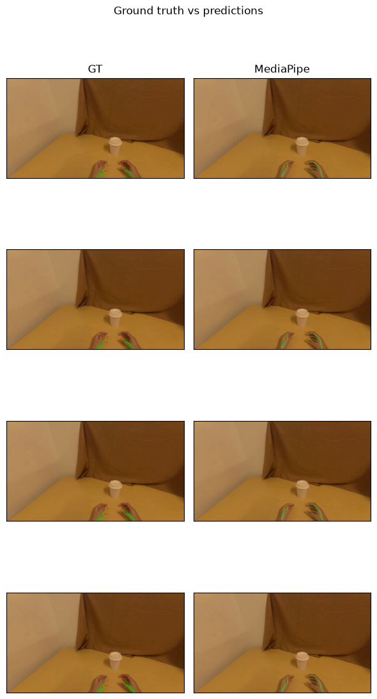

# Hand tracking

`track_hands` takes a Daft image column and returns a hand-pose column. A
LeRobot dataset is a natural source: Daft's native reader
`daft.datasets.lerobot` (added in [Daft #7090](https://github.com/Eventual-Inc/Daft/pull/7090))
decodes each camera into an image column with `load_video_frames`.

```python
import daft
from daft.datasets import lerobot
from daft_physical_ai.hands import track_hands

# one row per frame; the camera key is decoded into an image column.
# egodex-test is a tiny EgoDex sample (3 episodes / 632 frames) in LeRobot v3 format.
df = lerobot.read("pepijn223/egodex-test", load_video_frames="observation.image")

# pick a method (each returns the same schema):
# mediapipe -> CPU, 2D only, permissive license, no weights to supply
# wilor     -> GPU, 3D MANO keypoints (MANO weights user-supplied)
df = df.with_column("hands", track_hands(df["observation.image"], method="mediapipe"))

df.write_parquet("annotated/")
```

Install the method you need as an extra: `pip install "daft-physical-ai[mediapipe]"`
(CPU, 2D), `pip install "daft-physical-ai[wilor]"` (GPU, 3D), or
`pip install "daft-physical-ai[all]"` for both. WiLoR additionally needs a CUDA
`torch` build and `chumpy` from git
(`pip install 'chumpy @ git+https://github.com/mattloper/chumpy'`, omitted from the
extra because PyPI metadata can't carry direct references), plus a user-supplied
`MANO_RIGHT.pkl` ([research-gated](mano.md)).

## Output schema

One unified output schema regardless of method: each frame yields a list of
0-2 detected hands. A single hand value (MediaPipe):

```python
{
    "handedness": "right",        # "left", "right", or "unknown"
    "confidence": 0.979,
    "kp2d": [[1412.1, 1111.1],    # 21 image-space [x, y] keypoints
             [1357.9, 1075.9],
             ...],
    "kp3d": None,                 # 21 [x, y, z] keypoints, or null for 2D-only methods
}
```

The Daft type is `list[struct{ handedness: string, confidence: float32, kp2d:
list[list[float32]], kp3d: list[list[float32]] }]`, defined as `HANDS_DTYPE` in
`daft_physical_ai/hands/schema.py`.

## Example

A complete walkthrough - read a dataset, run `track_hands` (MediaPipe), draw the
keypoints, and score against EgoDex ground truth:



Available in three equivalent forms:

- **[examples/hands/demo.md](../examples/hands/demo.md)** - read it start to finish; code and outputs inline.
- **[examples/hands/demo.ipynb](../examples/hands/demo.ipynb)** - runnable notebook (outputs included).
- **[examples/hands/demo.py](../examples/hands/demo.py)** - plain script.

Generate your own (other methods, a Modal GPU runtime, with/without eval) with the
`daft-physical-ai hands` command - run it with no flags for an interactive
walkthrough, or pass flags:

```bash
# No flags - interactive walkthrough that asks a few questions
uvx daft-physical-ai hands

# --no-input skips all prompts; flags supply the answers, the rest use defaults
uvx daft-physical-ai hands --method mediapipe --output-dir my-demo --no-input
uvx daft-physical-ai hands --method wilor --runtime modal --mano-path ./MANO_RIGHT.pkl --no-input
```
