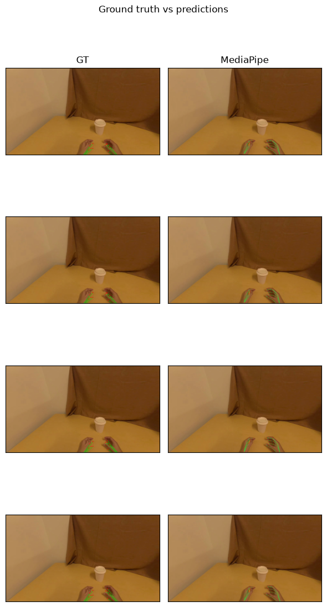

# Examples

A complete hand-tracking walkthrough, generated by the `daft-physical-ai` CLI:
read a LeRobot dataset, run `track_hands` (MediaPipe, CPU), draw the keypoints
against the EgoDex ground truth, and score them (detect% + PCK).



Three equivalent forms:

- **`demo.md`** - read it start to finish; code and outputs inline, nothing to run.
- **`demo.ipynb`** - the same, executed (outputs included); open in JupyterLab.
- **`demo.py`** - plain script.

Run them:

```bash
# deps fetched on the fly, nothing to install
uv run --with "daft-physical-ai[mediapipe]" --with matplotlib --with scipy examples/demo.py
# or in JupyterLab (the ulimit is a temporary workaround for a Daft progress-bar
# crash in Jupyter, see issue #24):
ulimit -n 10240 && uvx --from jupyterlab --with "daft-physical-ai[mediapipe]" --with matplotlib --with scipy jupyter-lab examples/demo.ipynb
```

Want a different setup (WiLoR, both methods, a Modal GPU runtime, with/without
eval)? Generate your own:

```bash
daft-physical-ai hands      # interactive
daft-physical-ai hands --method wilor --runtime modal --mano-path MANO_RIGHT.pkl --no-input
```

> The committed files here are *executed* (so outputs and the image show without
> running). The CLI generates the same structure as a fresh starting point.
